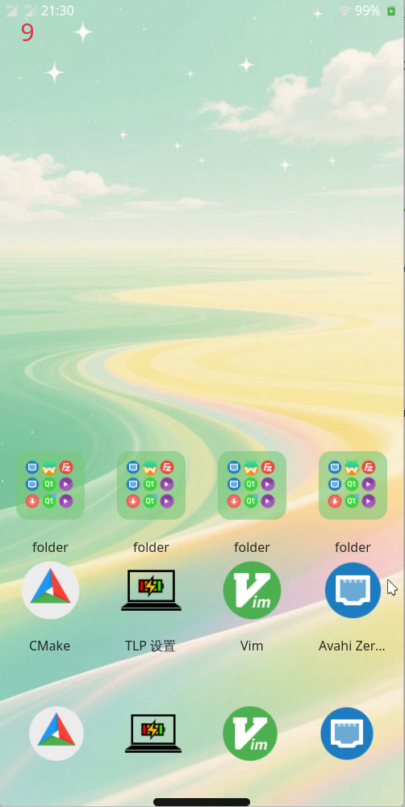

# A Linux mobile operating interface based on Gtk4
## 一个基于Gtk4的Linux手机操作界面

## __项目进展__
### What has been implemented so far:lock screen interface, desktop icons, desktop folders, app drawer, notification bar, message center, control center, taskbar, and task background.
### 目前已经实现的内容：锁屏界面，桌面图标，桌面文件夹，应用抽屉，通知栏，消息中心，控制中心，任务栏，任务后台

### What remains to be implemented: movable desktop icons, desktop folders that can automatically adjust their size based on the number of icons, and a complete notification interface.
### 还未实现的内容：可以移动的桌面图标，可以根据图标数量自适应大小的桌面文件夹，完整的通知界面

## __界面预览__

